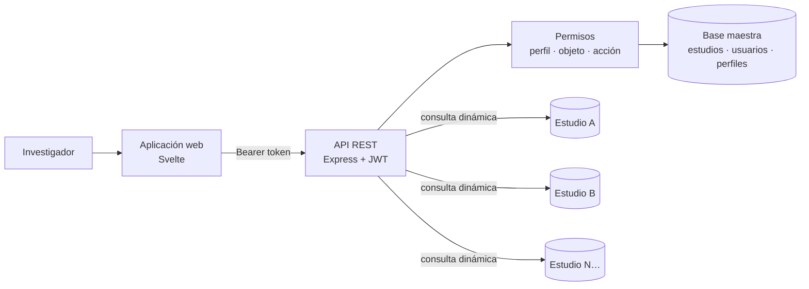

# app-consulta — Showcase

> Plataforma web para **analizar encuestas y estudios poblacionales georreferenciados**: el investigador arrastra preguntas y respuestas para armar consultas, y obtiene resultados agrupados en gráficos 2D/3D, en un mapa con GPS y en documentos Word, sin escribir SQL.

> [!IMPORTANT]
> **Este repositorio es solo de exhibición.** Contiene la descripción del proyecto, capturas de pantalla y una selección mínima de fragmentos de código. **No es funcional ni reproducible**: faltan módulos, configuración, esquemas de base de datos y datos a propósito. El código fuente completo es privado.

---

## Contenido

1. [¿Qué es app-consulta?](#qué-es-app-consulta)
2. [Cómo se usa](#cómo-se-usa)
3. [Funcionalidades](#funcionalidades)
4. [Stack tecnológico](#stack-tecnológico)
5. [Arquitectura](#arquitectura)
6. [Capturas](#capturas)
7. [Aspectos técnicos destacados](#aspectos-técnicos-destacados)
8. [Estructura y muestras de código](#estructura-del-proyecto-y-muestras-de-código)
9. [Autor y licencia](#autor-y-licencia)

---

## ¿Qué es app-consulta?

Una firma de investigación social recoge en campo miles de encuestas con dispositivos móviles y posicionamiento GPS: estudios socioeconómicos, de percepción y de intención de voto. app-consulta es la herramienta con la que el equipo **explora esos datos**: cada estudio se abre como un proyecto propio, con sus preguntas, sus respuestas y sus registros georreferenciados, y el investigador cruza variables hasta obtener las tablas, gráficos y mapas que necesita para su informe.

- **Un estudio, una base de datos:** cada estudio vive en su propia base MySQL; una base maestra los cataloga y controla quién puede verlos.
- **Consultas sin SQL:** las variables se arrastran a un área de trabajo y se les indica si se agrupan, se filtran, se suman o se promedian.
- **Del dato al informe:** el resultado se ve como gráfico, como mapa y se exporta a Word.

## Cómo se usa

1. **Elegir un estudio** de la lista (con buscador).
2. **Armar la consulta:** arrastrar preguntas y respuestas al área de trabajo. Para cada variable se define si se muestra y agrupa, qué valores o rangos se filtran, y si se calcula suma o promedio.
3. **Ver el resultado** como una *Workarea*: tabla agrupada con cantidad y porcentaje, gráfico de dona o barras (2D o 3D) y mapa con los registros coloreados por grupo.
4. **Guardar** la Workarea para retomarla después y **exportarla a Word** con sus gráficos.
5. **Ficha técnica:** hoja de control de la muestra. Cada ítem ejecuta un conteo y lo compara con un límite (cuota), muestra el porcentaje de avance y alerta cuando se alcanza.

## Funcionalidades

| Funcionalidad | Qué resuelve |
|---|---|
| **Estudios (multi-base)** | Catálogo de estudios; cada uno con su propia base de datos de preguntas, respuestas, encuestas y ubicaciones. |
| **Constructor de consultas** | Arrastrar y soltar preguntas/respuestas; agrupar, filtrar por valores o rangos, sumar y promediar; porcentaje calculado sobre el total. |
| **Workareas guardadas** | Cada análisis se guarda por usuario y estudio, y se recarga con su resultado. |
| **Gráficos 2D y 3D** | Dona, torta y barras (Chart.js) y versiones 3D (Three.js), con agrupación automática de categorías pequeñas y paletas de color personalizables. |
| **Mapa georreferenciado** | Cada encuesta se ubica por GPS y se colorea según el grupo de la consulta (Leaflet). |
| **Exportación** | Informe en Word con los gráficos incluidos y tablas de datos. |
| **Ficha técnica** | Control de cuotas de la muestra con porcentaje de avance y alertas al llegar al límite. |
| **Usuarios, perfiles y permisos** | Permisos por perfil sobre objetos (menús, pantallas, acciones y APIs), con jerarquía MENU → SCREEN → PERMISO. |
| **Personalización** | Fondo de pantalla, imágenes y paleta de colores por usuario. |

## Stack tecnológico

| Capa | Tecnologías |
|---|---|
| **Aplicación web** | Svelte 3, Vite, DataTables, Leaflet, Chart.js, Three.js, `docx`, `html2canvas`, `exceljs`, IndexedDB |
| **API** | Node.js, Express, JWT, Multer y Sharp para imágenes |
| **Datos** | MySQL (`mysql2`), una base maestra y una base por estudio |
| **En evolución** | Reescritura en SvelteKit / Svelte 5 con Tailwind CSS 4 y DaisyUI |

## Arquitectura



- **Router genérico:** la API expone pocos *endpoints* (`/bases`, `/read`, `/update`, `/remove`, `/upload`) y el nombre de la operación viaja como parámetro; cada uno delega en un modelo.
- **Consulta declarativa:** la interfaz envía una definición (variables, filtros, agrupaciones, métricas) y el servidor la traduce a SQL sobre la base del estudio elegido.
- **Permisos en dos niveles:** un *middleware* valida el perfil del usuario contra la acción y el recurso, y las pantallas consultan la jerarquía de objetos para mostrar u ocultar opciones.

## Capturas

<!-- CAPTURAS -->

## Aspectos técnicos destacados

### Permisos por perfil, objeto y acción
El *middleware* `verifyProfile(ruta)` resuelve qué objeto protege una operación (con fallback a un comodín cuando el recurso no tiene regla propia) y comprueba si el perfil del usuario lo tiene asignado. La segunda vía, `validaPermiso`, valida la jerarquía completa MENU → SCREEN → PERMISO con un único `JOIN`. Ambas usan consultas parametrizadas. → [`code-samples/api/verifyProfile.js`](code-samples/api/verifyProfile.js) · [`code-samples/api/permisos.js`](code-samples/api/permisos.js)

### Ficha técnica: cuotas de muestra con alertas
Cada ítem de la ficha guarda su propio conteo y un límite. El servidor lo ejecuta, calcula el porcentaje de avance, indica si se superó el límite y devuelve el mensaje de alerta configurado para ese ítem. → [`code-samples/api/modelFichaTecnica.js`](code-samples/api/modelFichaTecnica.js)

### Construcción de consultas por arrastrar y soltar
Las preguntas son tarjetas arrastrables que llevan su definición serializada; el área de trabajo las recibe, las agrupa y arma la consulta. → [`code-samples/web/Pregunta.svelte`](code-samples/web/Pregunta.svelte)

### Gráficos con *plugins* propios
La dona combina Chart.js con dos *plugins* propios: el total al centro y líneas guía con la etiqueta de cada porción (solo para las que superan el 1 %). Los colores salen de una paleta configurable por Workarea. → [`code-samples/web/PieChart.svelte`](code-samples/web/PieChart.svelte)

### Un estudio, una base de datos
Aislar cada estudio en su base permite archivar, respaldar o compartir un estudio completo sin mezclar información entre clientes, y mantiene las tablas de cada uno ajustadas a su cuestionario.

## Estructura del proyecto y muestras de código

Estructura resumida. Los archivos marcados con ✔ son los únicos incluidos aquí, en [`code-samples/`](code-samples); el resto es privado.

```
app-consulta/
├── API/                              # API Express
│   ├── routes/                       # router genérico (bases · read · update · remove · upload)
│   ├── controllers/                  # despacho por nombre de operación
│   ├── models/                       # consultas, workareas, usuarios, perfiles, ficha técnica…
│   │   └── modelFichaTecnica.js                       ✔
│   └── lib/
│       ├── verifyProfile.js                           ✔
│       └── permisos.js                                ✔
├── WEB/                              # aplicación Svelte
│   └── src/
│       ├── components/main/          # investigaciones, consultas, ficha, configuración
│       │   └── Investigaciones/Pregunta.svelte        ✔
│       └── lib/                      # gráficos 2D/3D, mapa, tablas, exportación a Word
│           └── PieChart.svelte                        ✔
└── SVELTEKIT/                        # reescritura en curso (Svelte 5)
```

| Archivo | Qué muestra |
|---|---|
| [`code-samples/api/verifyProfile.js`](code-samples/api/verifyProfile.js) | *Middleware* de permisos por perfil, objeto y acción |
| [`code-samples/api/permisos.js`](code-samples/api/permisos.js) | Validación de la jerarquía MENU → SCREEN → PERMISO |
| [`code-samples/api/modelFichaTecnica.js`](code-samples/api/modelFichaTecnica.js) | Control de cuotas de la muestra con alerta por límite |
| [`code-samples/web/Pregunta.svelte`](code-samples/web/Pregunta.svelte) | Tarjeta de pregunta arrastrable |
| [`code-samples/web/PieChart.svelte`](code-samples/web/PieChart.svelte) | Gráfico de dona con *plugins* propios |

## Autor y licencia

Desarrollado por **Exel Avendaño** — diseño, backend, frontend y visualización de datos.

Todos los derechos reservados. Consulta el archivo [LICENSE](LICENSE): el contenido es solo para consulta y evaluación.
